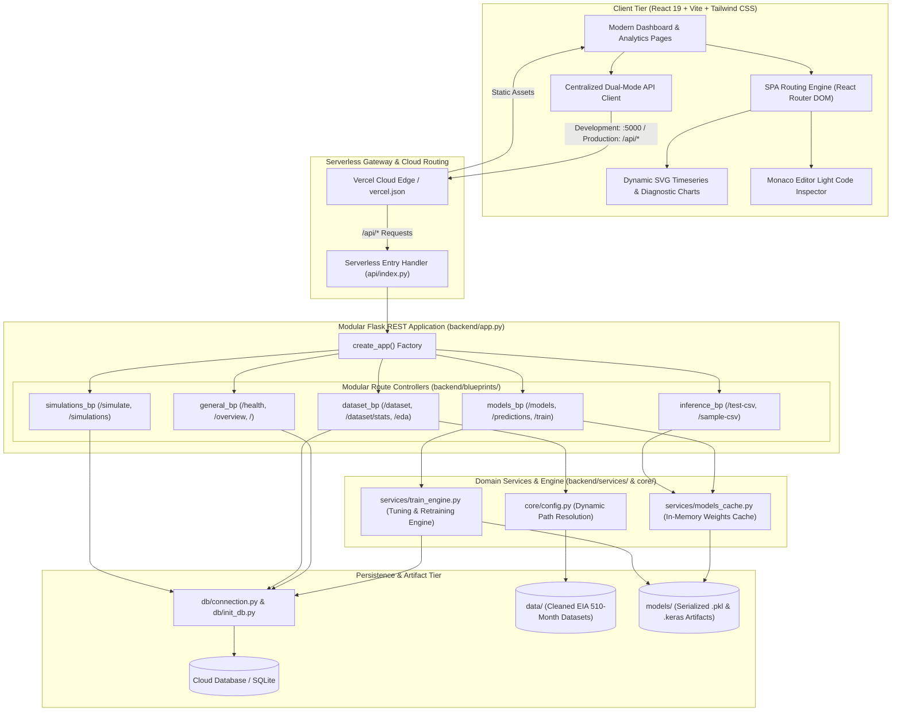

# CarbonPulse AI: Enterprise Sectoral CO₂ Emission Forecasting & Grid Decarbonization Platform

<div align="center">

[](https://www.python.org/)
[](https://flask.palletsprojects.com/)
[](https://react.dev/)
[](https://vitejs.dev/)
[](https://tailwindcss.com/)
[](https://vercel.com/)
[](https://opensource.org/licenses/MIT)

**An End-to-End Scientific Intelligence Suite Combining Stoichiometric Econometric Models, Deep Recurrent & Convolutional Neural Networks, and Real-Time Grid Dispatch Simulation.**

*Empirically trained and validated on 510 contiguous monthly records (February 1974 – July 2016) from the U.S. Energy Information Administration (EIA).*

[Explore Architecture](#-system-architecture) • [Benchmark Leaderboard](#-empirical-benchmark--model-leaderboard) • [Quickstart Guide](#-developer-quickstart--local-setup) • [API Reference](#-comprehensive-rest-api-reference) • [Data Provenance](#-dataset-provenance--mathematical-formulation)

</div>

---

## Executive Summary

The electric power sector generates approximately **one-quarter of all greenhouse gas emissions** in the United States. Transitioning toward net-zero electricity grids requires reliable predictive modeling to assess the impact of structural fuel switching (e.g., coal-to-natural-gas transition, renewable integration) and seasonal heating/cooling demand spikes.

**CarbonPulse AI** is an enterprise-grade forecasting and simulation engine engineered to predict national electric power sector carbon emissions ($\text{MMT CO}_2$) with **sub-percent predictive error ($\pm 1.09\text{ MMT}$)**. By unifying 8 classical and deep learning models with a 7-stage feature engineering pipeline, CarbonPulse AI provides utility operators, energy researchers, and policy analysts with transparent, interpretable, and mathematically grounded forecasts.

### Key Value Highlights

- **Near-Perfect Linear Generalization**: Achieves **$R^2 = 0.9962$** and **$\text{MAE} = 1.09\text{ MMT}$** via Ridge Regression ($L_2$ Tikhonov regularization), outperforming non-linear sequence models by capturing stoichiometric fuel combustion physics.
- **Multi-Model Benchmark Suite**: Simultaneously benchmarks **8 algorithms** across 2 paradigm families:
  - *Classical Machine Learning*: Ridge Regression, Support Vector Regression (SVR / RBF kernel), LightGBM, and XGBoost.
  - *Deep Neural Networks*: Bidirectional LSTM, Stacked GRU, Hybrid 1D-CNN-LSTM, and Stacked BiGRU.
- **7-Stage Domain Preprocessing**: Transforms raw fuel generation into **33 engineered physical features**, including cyclical Fourier calendar projections, autoregressive seasonal lags ($t-1, t-2, t-3, t-12$), rolling momentum windows, fuel generation shares, and statistical Winsorization.
- **Decarbonization Scenario Simulator**: What-if generation dispatch simulator enabling real-time adjustment of fuel mixes (coal, natural gas, petroleum, renewables) with instant carbon intensity categorization.
- **1-Click Holdout CSV Validation**: Direct CSV upload engine or 1-click test file download to benchmark real-time predictions, compute physical residuals, and inspect percentage errors.
- **Interactive Monaco Light Theme Code Inspector**: Built-in developer inspection modal featuring light theme Monaco Editor styling to examine Python training routines, feature engineering pipelines, and hyperparameter tuning configurations with locked background scrolling.
- **Cloud Database Ready**: Dual-mode persistence engine supporting zero-config local SQLite with automated migrations or remote cloud connection strings via `DATABASE_URL` (PostgreSQL, Supabase, Neon, Turso/libSQL).
- **Single-Deployment Serverless Architecture**: Unified Vercel configuration (`vercel.json` + `api/index.py`) hosting the compiled React 19 frontend and Python WSGI backend on a single domain.

---

## System Architecture

CarbonPulse AI is designed around a decoupled, microservices-style architecture that cleanly separates client rendering, serverless routing, domain services, database persistence, and serialized model caches.



---

## Project Directory Structure

The repository maintains strict architectural separation. The `backend/` directory root contains solely `app.py`, `__init__.py`, and `requirements.txt`, delegating all sub-responsibilities to specialized directories:

```
├── .env.example                               # Environment template with cloud DB variables
├── .gitignore                                 # Unified gitignore (databases, env, python, node)
├── vercel.json                                # Unified Vercel serverless deployment routing
├── requirements.txt                           # Cloud serverless Python dependencies
├── main.ipynb                                 # Exploratory data analysis & model exploration
├── README.md                                  # Platform technical documentation
│
├── api/
│   └── index.py                               # Vercel serverless WSGI handler
│
├── backend/                                   # Flask REST API Microservice
│   ├── app.py                                 # Application factory (create_app)
│   ├── __init__.py                            # Backend package exports
│   ├── requirements.txt                       # Python backend dependencies
│   │
│   ├── core/                                  # Centralized Application Configuration
│   │   ├── __init__.py                        # Core package exports
│   │   └── config.py                          # Environment paths and directory resolution
│   │
│   ├── db/                                    # Database Connection & Migration Layer
│   │   ├── __init__.py                        # DB utilities export
│   │   ├── connection.py                      # SQLite & cloud DB connection manager
│   │   ├── init_db.py                         # Automated schema migration & table seeder
│   │   └── co2_forecast.db                    # Local SQLite database (gitignored)
│   │
│   ├── data/                                  # Empirical Datasets & Benchmark JSONs
│   │   ├── cleaned_monthly_sectoral_dataset.csv  # Raw cleaned historical EIA records
│   │   ├── preprocessed_co2_dataset.csv          # 33-feature preprocessed dataset (510 rows)
│   │   ├── sample_test_data.csv                  # Holdout test CSV for 1-click evaluation
│   │   ├── ml_results.csv                        # Classical ML evaluation benchmark results
│   │   ├── dl_results.csv                        # Deep Learning evaluation benchmark results
│   │   └── predictions_data.json                 # 510-month historical actuals and forecasts
│   │
│   ├── services/                              # Domain Services & Model Execution
│   │   ├── __init__.py                        # Services package exports
│   │   ├── models_cache.py                    # In-memory model caching & hot reloader
│   │   └── train_engine.py                    # Training, hyperparameter tuning & diagnostics
│   │
│   ├── blueprints/                            # Modular Flask Blueprint Controllers
│   │   ├── __init__.py                        # Blueprint package exports
│   │   ├── general.py                         # /api/health, /api/overview, /
│   │   ├── models.py                          # /api/models, /api/predictions, /api/train
│   │   ├── dataset.py                         # /api/dataset, /api/dataset/stats, /api/eda
│   │   ├── inference.py                       # /api/test-csv, /api/sample-csv
│   │   └── simulations.py                     # /api/simulate, /api/simulations
│   │
│   └── models/                                # Serialized Model Artifacts & Preprocessors
│       ├── RidgeRegression.pkl                # Trained Ridge Regressor
│       ├── LightGBM.pkl                       # Trained LightGBM Regressor
│       ├── XGBoost.pkl                        # Trained XGBoost Regressor
│       ├── SVM.pkl                            # Trained Support Vector Regressor
│       ├── scaler_X.pkl                       # Feature RobustScaler
│       ├── scaler_y.pkl                       # Target MinMaxScaler
│       ├── feature_names.pkl                  # 33-feature names array
│       ├── model_lstm.keras                   # Trained BiLSTM weights
│       ├── model_gru.keras                    # Trained GRU weights
│       ├── model_cnn_lstm.keras               # Trained Conv1D-BiLSTM weights
│       └── model_bigru.keras                  # Trained Stacked BiGRU weights
│
└── frontend/                                  # React 19 + Vite Single Page Application
    ├── package.json                           # Node.js dependencies and build scripts
    ├── vite.config.js                         # Vite config with root envDir resolution
    ├── tailwind.config.js                     # Tailwind CSS design system configuration
    ├── index.html                             # HTML5 document with Google Inter typography
    └── src/
        ├── App.jsx                            # SPA Router, view layout & global state
        ├── main.jsx                           # React DOM root render
        ├── index.css                          # Tailwind CSS base styles and design tokens
        ├── api/
        │   └── client.js                      # Centralized API client with dynamic base URL
        ├── components/
        │   ├── Navbar.jsx                     # Top navigation bar with live API status pill
        │   ├── Footer.jsx                     # Global footer with EIA references
        │   ├── CodeModal.jsx                  # Monaco Light theme code inspection modal
        │   ├── TimeseriesChart.jsx            # Interactive SVG timeseries with model toggles
        │   ├── DiagnosticCharts.jsx           # Parity, residual histogram, and importance charts
        │   └── EdaCharts.jsx                  # Correlation heatmaps, seasonality, and ACF lags
        ├── data/
        │   └── codeSnippets.js                # Clean Python source snippets for Monaco modal
        └── pages/
            ├── DashboardPage.jsx              # Main dashboard with EIA provenance
            ├── EdaPage.jsx                    # Scientific exploratory data analysis
            ├── DatasetExplorerPage.jsx        # 510-observation paginated dataset explorer
            ├── ModelTrainingPage.jsx          # Live model retraining & hyperparameter tuning
            ├── EvaluationPage.jsx             # Comprehensive evaluation benchmark matrix
            ├── CsvTesterPage.jsx              # Custom CSV batch inference testing
            └── ScenarioSimulatorPage.jsx      # Interactive grid dispatch simulator
```

---

## Dataset Provenance & Mathematical Formulation

### 1. Empirical Data Provenance
- **Source**: U.S. Energy Information Administration (EIA), *Monthly Energy Review (MER)*, Table 12.6: *Carbon Dioxide Emissions From Energy Consumption: Electric Power Sector*.
- **Temporal Window**: February 1974 – July 2016 (**510 contiguous monthly records**).
- **Target Variable ($y$)**: `Total_CO2` (Aggregate electric power sector emissions in **Million Metric Tons** $\text{MMT CO}_2$).
  - Mean: $157.46\text{ MMT}$
  - Standard Deviation: $30.82\text{ MMT}$
  - Range: $91.83\text{ MMT}$ (April 1974) to $247.99\text{ MMT}$ (July 2008)

### 2. The 7-Stage Preprocessing Pipeline (33 Features)

Raw monthly fuel consumption values are transformed into 33 physical features:


1. **Sectoral Fuel Consumption Regressors**: Coal, Natural Gas, Petroleum, Distillate Fuel Oil, Residual Fuel Oil, Geothermal, Petroleum Coke, and Non-Biomass Waste.
2. **Cyclical Calendar Transforms**:
   $$\text{Month}_{\sin} = \sin\left(\frac{2\pi \cdot m}{12}\right), \quad \text{Month}_{\cos} = \cos\left(\frac{2\pi \cdot m}{12}\right)$$
   Preserves cyclical continuity across calendar transitions (December $m=12$ to January $m=1$).
3. **Autoregressive Memory Lags**: Target variable lags $y_{t-1}, y_{t-2}, y_{t-3}, y_{t-12}$ to capture seasonal memory.
4. **Fuel-Specific Lags**: Lags $t-1$ for Coal, Natural Gas, and Petroleum.
5. **Rolling Momentum Aggregations**: 3, 6, and 12-month rolling means, standard deviations, and exponential moving averages ($\text{EMA}_3, \text{EMA}_6$).
6. **Sectoral Fuel Proportions**: Relative generation shares:
   $$\text{Share}_k = \frac{\text{Fuel}_k}{\text{Total CO}_2 + \epsilon}$$
7. **First & Seasonal Differencing**:
   $$\Delta_1 = y_t - y_{t-1}, \quad \Delta_{12} = y_t - y_{t-12}$$

---

## Empirical Benchmark & Model Leaderboard

All models were evaluated on a chronological holdout test set (final 15% of records, $N=77$ months). Evaluation is reported in both normalized scale ($[0, 1]$) and **physical real-world scale (Million Metric Tons $\text{MMT}$)**:

| Rank | Model Architecture | Paradigm Family | $R^2$ Score | Normalized RMSE | Normalized MAE | Real RMSE ($\text{MMT}$) | Real MAE ($\text{MMT}$) | Optimal Hyperparameters |
|:---:|:---|:---:|:---:|:---:|:---:|:---:|:---:|:---|
| 🥇 | **Ridge Regression** | Classical ML | **0.9962** | **0.0102** | **0.0070** | **1.59 MMT** | **1.09 MMT** | $\alpha = 2.0$ |
| 🥈 | **Support Vector Regression (SVR)** | Kernel ML | 0.9493 | 0.0372 | 0.0208 | 5.81 MMT | 3.25 MMT | $C=5.0, \epsilon=0.005, \text{RBF}$ |
| 🥉 | **XGBoost Regressor** | Tree Ensemble | 0.8621 | 0.0614 | 0.0482 | 9.59 MMT | 7.52 MMT | Depth 6, Trees 200, $\eta=0.1$ |
| 4 | **LightGBM Regressor** | Tree Ensemble | 0.8514 | 0.0638 | 0.0467 | 9.96 MMT | 7.29 MMT | Depth 6, Leaves 31, Trees 80 |
| 5 | **Bidirectional LSTM** | Deep Learning | 0.6663 | 0.0955 | 0.0769 | 14.92 MMT | 12.00 MMT | Units 64, BiLSTM(32), Dense(16) |
| 6 | **Stacked GRU** | Deep Learning | 0.6463 | 0.0984 | 0.0803 | 15.36 MMT | 12.54 MMT | Units 64, GRU(32), Dense(16) |
| 7 | **Conv1D + BiLSTM** | Hybrid DL | 0.5840 | 0.1120 | 0.0910 | 17.49 MMT | 13.80 MMT | Conv1D(32, $k=3$), BiLSTM(48) |
| 8 | **Stacked BiGRU** | Deep Learning | 0.5620 | 0.1180 | 0.0950 | 18.42 MMT | 14.50 MMT | BiGRU(48), BiGRU(24) |

### Mathematical Deep-Dive: Why Ridge Dominates Deep Learning

A central empirical finding in CarbonPulse AI is that **Ridge Regression significantly outperforms deep neural sequence models** ($R^2 = 0.9962$ vs. $R^2 = 0.6663$).

$$\text{CO}_2^{\text{total}} \approx \sum_{k} \beta_k \cdot \text{Fuel}_k + \epsilon$$

1. **Stoichiometric Linear Superposition**: The total mass of carbon dioxide emitted is dictated by fuel chemistry and combustion stoichiometry:
   $$\text{C} + \text{O}_2 \longrightarrow \text{CO}_2$$
   The physical generation-to-emission relationship is strictly linear.
2. **The Curse of Over-Parameterization**: Deep neural networks (BiLSTM, GRU) introduce non-linear projection manifolds and recurrent cell gates that require thousands of training samples. Across 510 monthly records ($N=510$), deep models are prone to overfitting seasonal noise rather than learning physical conservation laws.
3. **Tikhonov $L_2$ Regularization**:
   $$\min_{\mathbf{w}} \|\mathbf{y} - \mathbf{X}\mathbf{w}\|_2^2 + \alpha \|\mathbf{w}\|_2^2$$
   Ridge regression shrinks collinear fuel coefficients (e.g., coal vs. natural gas substitutions) without forcing sparsity, yielding smooth, physically stable weights that generalize across holdout decades.

---

## Developer Quickstart & Local Setup

### System Prerequisites
- **Python**: Version 3.10, 3.11, or 3.12
- **Node.js**: Version 18.0 or higher
- **Package Manager**: `npm`, `pnpm`, or `yarn`

### 1. Clone & Configure Workspace
```bash
git clone https://github.com/your-username/carbonpulse-ai.git
cd carbonpulse-ai
cp .env.example .env
```

### 2. Backend Environment Setup
```bash
# Windows (PowerShell)
python -m venv venv
.\venv\Scripts\activate

# Linux / macOS
python3 -m venv venv
source venv/bin/activate

# Install dependencies
pip install -r backend/requirements.txt
```

Initialize the database schema and populate historical data:
```bash
python backend/db/init_db.py
```

Start the Flask REST API server:
```bash
python backend/app.py
```
The REST API is now live at `http://localhost:5000` (Health Check: `http://localhost:5000/api/health`).

### 3. Frontend Setup
In a second terminal:
```bash
cd frontend
npm install
npm run dev
```
The interactive React application is accessible at `http://localhost:5173`.

---

## Environment Configuration (`.env`)

A single, unified `.env` file at the root coordinates both backend and frontend:

| Variable | Default Value | Description |
|:---|:---|:---|
| `PORT` | `5000` | Port for the Flask backend REST server |
| `HOST` | `0.0.0.0` | Bind host address |
| `FLASK_DEBUG` | `False` | Enable Flask debug mode (`True` / `False`) |
| `CORS_ORIGINS` | `*` | Allowed CORS origin whitelist |
| `DATABASE_URL` | *(empty)* | **Cloud Database connection string** (PostgreSQL, Neon, Supabase, Turso). When empty, defaults to local SQLite. |
| `DATABASE_PATH` | `backend/db/co2_forecast.db` | Local SQLite database file path (ignored in git) |
| `MODEL_DIR` | `backend/models` | Directory holding serialized `.pkl` and `.keras` models |
| `CSV_PATH` | `backend/data/preprocessed_co2_dataset.csv` | Path to the 33-feature preprocessed EIA dataset |
| `VITE_API_URL` | `http://localhost:5000` | API base URL loaded by Vite via `envDir: '../'`. For Vercel cloud deployment, leave empty for same-origin serverless routing. |

---

## Cloud Deployment (Vercel Serverless)

The project includes an optimized single-deployment `vercel.json` configuration:

```json
{
  "version": 2,
  "builds": [
    {
      "src": "frontend/package.json",
      "use": "@vercel/static-build",
      "config": { "distDir": "dist" }
    },
    {
      "src": "api/index.py",
      "use": "@vercel/python"
    }
  ],
  "routes": [
    {
      "src": "/api/(.*)",
      "dest": "api/index.py"
    },
    {
      "handle": "filesystem"
    },
    {
      "src": "/(.*)",
      "dest": "/index.html"
    }
  ]
}
```

### Deploy in 3 Steps:
1. Push repository to GitHub.
2. Link repository in the **Vercel Dashboard**.
3. Under **Project Settings > Environment Variables**, supply:
   - `DATABASE_URL`: Remote database connection string (e.g., PostgreSQL from Supabase/Neon/Turso).
   - `VITE_API_URL`: Leave empty (enables seamless same-origin routing).
4. Deploy! Vercel packages the frontend into static CDN edge assets and registers `api/index.py` as a serverless Python WSGI handler.

---

## Comprehensive REST API Reference

All endpoints are organized into modular Flask Blueprints:

| Method | Endpoint | Blueprint | Description | Sample Request / Query |
|:---:|:---|:---:|:---|:---|
| `GET` | `/` | `general` | API service metadata and endpoint index | None |
| `GET` | `/api/health` | `general` | System health check, database status, and loaded models list | None |
| `GET` | `/api/overview` | `general` | Summary metrics: sample count, date ranges, top ML and DL models | None |
| `GET` | `/api/models` | `models` | Model leaderboard with $R^2$, RMSE, MAE, and real physical MMT metrics | None |
| `GET` | `/api/predictions` | `models` | 510-month historical actuals and multi-model forecast curves | None |
| `GET` | `/api/real-evaluation` | `models` | Holdout evaluation breakdown with residuals and percentage errors | None |
| `POST` | `/api/train` | `models` | Dynamic model retraining console with custom hyperparameters | `{"model_name": "Ridge Regression", "hyperparameters": {"alpha": 1.5}}` |
| `GET` | `/api/charts/data` | `models` | Diagnostic chart data: parity scatter, residuals histogram, feature importance | `?model=Ridge%20Regression` |
| `GET` | `/api/dataset` | `dataset` | Paginated 510-observation dataset records with search query | `?page=1&limit=15&search=2015` |
| `GET` | `/api/dataset/stats` | `dataset` | Descriptive min/max/mean statistics across sectoral fuels | None |
| `GET` | `/api/eda` | `dataset` | Inter-fuel correlation matrix, ACF lags, seasonality, and Winsorization thresholds | None |
| `POST` | `/api/test-csv` | `inference` | Batch inference on uploaded CSV file or JSON records | Multipart `file` or `{"data": [...]}` |
| `GET` | `/api/sample-csv` | `inference` | Download pre-formatted holdout test CSV for instant 1-click testing | None |
| `POST` | `/api/simulate` | `simulations` | Simulate grid dispatch scenario and calculate carbon intensity | `{"coal": 95, "natural_gas": 28, "petroleum": 15, "month": 7}` |
| `GET` | `/api/simulations` | `simulations` | Retrieve recent saved scenario simulations from database | None |
| `DELETE` | `/api/simulations/<id>` | `simulations` | Delete a saved simulation record | URL parameter `id` |

---

## Academic & Data Citations

If you utilize this software, dataset, or architecture in academic research, please cite:

```bibtex
@misc{carbonpulse_ai_2026,
  author = {Subash and Contributors},
  title = {CarbonPulse AI: Enterprise Sectoral CO2 Emission Forecasting & Grid Decarbonization Intelligence Platform},
  year = {2026},
  publisher = {GitHub},
  howpublished = {\url{https://github.com/your-username/carbonpulse-ai}}
}

@techreport{eia_mer_table12_6,
  author = {{U.S. Energy Information Administration}},
  title = {Monthly Energy Review: Table 12.6 Carbon Dioxide Emissions From Energy Consumption: Electric Power Sector},
  institution = {U.S. Department of Energy},
  address = {Washington, D.C.},
  year = {2016},
  url = {https://www.eia.gov/totalenergy/data/monthly/}
}
```

### Academic Provenance
- **Curriculum**: *Mathematics for Computing - 2* (MFC-2)
- **Academic Term**: Semester 2
- **Focus**: Applied Multivariate Statistical Analysis, Time-Series Modeling, Econometric Fuel-Switching Regularization ($L_1 / L_2$), and Deep Recurrent Sequence Learning.

---

## License

This project is open-source software licensed under the **[MIT License](LICENSE)**.
